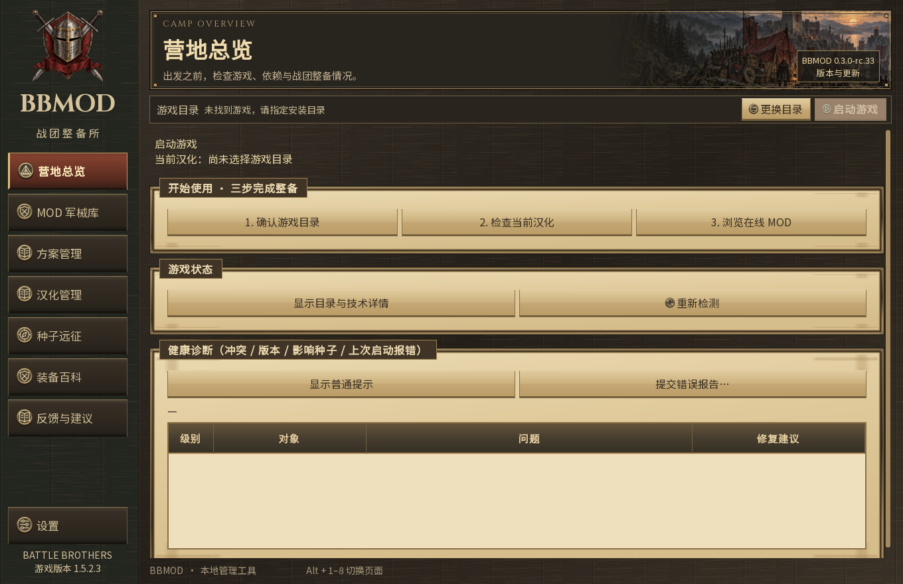
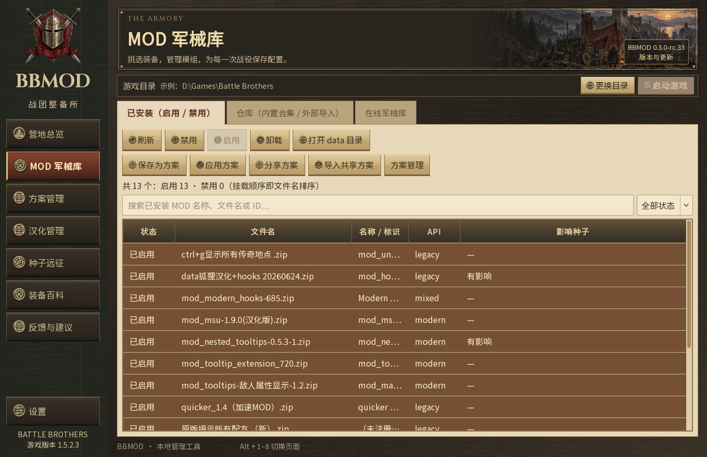
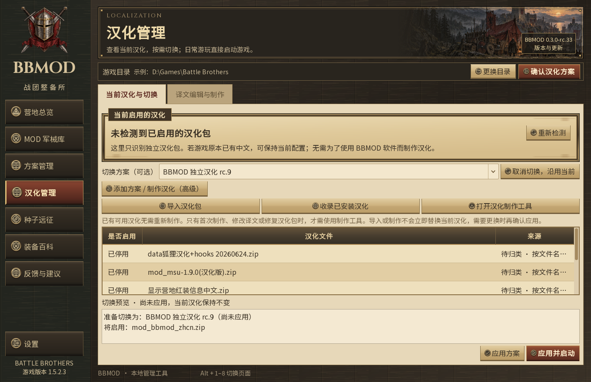
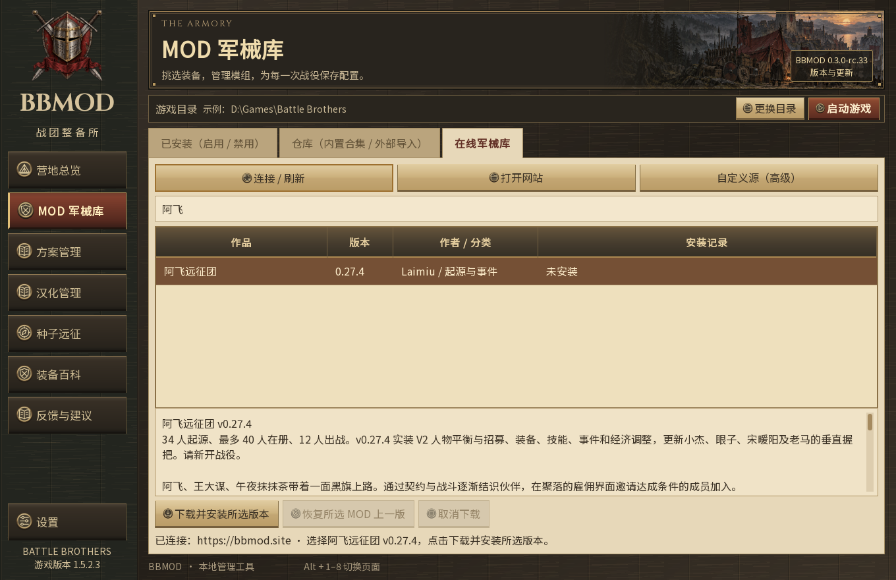

# BBMOD 新手使用说明：从零玩上阿飞起源

不会装 MOD，也可以按顺序操作。本文会带你完成：**安装正版游戏 → 打开 BBMOD → 停用旧 MOD → 换成 BBMOD 汉化 → 安装阿飞起源 → 新建战役。**

本文按 **2026 年 9 月 29 日** 核对的版本编写：**BBMOD 0.3.0-rc.33、阿飞远征团 0.27.4、BBMOD 独立汉化 0.3.0-rc.9**。它们是三个不同的文件，版本号不需要相同。“阿飞起源”在软件和游戏里叫 **「阿飞远征团」**。

> 第一次按本教程安装，最终只启用两个 MOD：`mod_bbmod_zhcn.zip` 和 `mod_afeix_expedition.zip`。先用这套组合开局，其他辅助 MOD 以后再逐个核对、添加。

## 先看这里：没有 DLC 能不能用？

**BBMOD 管理器本身不要求买齐 DLC；但阿飞起源 v0.27.4 的目标环境是《战场兄弟》1.5.2.3 加官方 DLC，不能把“只有本体”当成已经验证可玩的环境。** DLC 就是官方扩展内容，BBMOD 不会替游戏补装这些内容。

阿飞起源目前公布的目标环境包含下面五项 DLC。只有 Steam 本体的玩家可以使用 BBMOD，但阿飞起源在无 DLC 环境下的开局、战斗和存读档尚未完成兼容测试。

| DLC 英文名 | 方便辨认的中文称呼 |
| --- | --- |
| Lindwurm | 林德蠕龙 |
| Beasts & Exploration | 野兽与探索 |
| Warriors of the North | 北方勇士 |
| Blazing Deserts | 炽热沙漠 |
| Of Flesh and Faith | 血肉与信仰 |

**已有 Steam 游戏的朋友**：在 Steam 库里右键 Battle Brothers →「属性」→「DLC」，确认对应内容已安装；之后从第二步开始。需要核对游戏和 DLC，可查看 [Steam 商店页](https://store.steampowered.com/app/365360/Battle_Brothers/)和 [阿飞远征团作品页](https://bbmod.site/mods/d64a00f6-1d60-4d8d-8d9b-de055fc0b748/)。

## 第一步：安装正版《战场兄弟》

本教程以 Windows 上的 Steam 正版为例。已经装好游戏的朋友，可以直接从第二步开始。

1. 打开 Steam，登录自己的账号。还没有 Steam，可从 **[Steam 官网](https://store.steampowered.com/about/)** 下载安装。
2. 在 **[《战场兄弟》商店页](https://store.steampowered.com/app/365360/Battle_Brothers/)** 找到 **Battle Brothers**；尚未拥有游戏时，通过商店购买。
3. 在 Steam 的「库」里找到 Battle Brothers，点击 **「安装」**，选择安装位置，等待下载完成。
4. 在库中右键游戏 →「属性」→「DLC」，查看已经拥有和安装的扩展内容。没有 DLC 的兼容说明见上一节。
5. 先从 Steam 启动一次游戏，确认能进入主菜单，再完全退出。
6. 在库中右键游戏 → **「管理」→「浏览本地文件」**，打开安装文件夹。这一层应能同时看到 **`data`** 和 **`win32`**。

应该找到这样的结构：

```text
Battle Brothers              ← 这是要交给 BBMOD 的游戏文件夹
├─ data
│  ├─ data_001.dat            ← 游戏原有文件，保留
│  ├─ data_003.dat 等         ← DLC 等游戏档案，保留
│  └─ 各种 MOD 的 .zip 文件  ← 稍后由 BBMOD 管理
└─ win32
   └─ BattleBrothers.exe      ← 游戏程序
```

**后面下载的 MOD ZIP 保持原样，不用解压。** 游戏 `data` 里的 `.dat` 是本体和 DLC 等原有档案，也不用解压或删除。

旧玩家请先备份重要存档，方法见后面的常见问题。

**这一步完成的标志：在普通文件夹窗口中，能看到同一层的 `data` 和 `win32`。**

## 第二步：下载并打开 BBMOD rc.33

1. 打开 **[BBMOD 官方下载页](https://bbmod.site/downloads/)**。
2. 下载推荐的 Windows 程序 **`BBMOD-0.3.0-rc.33.exe`**。后续发布新版时，以官网推荐版本为准。
3. 把下载好的程序放到准备长期保留的位置，例如桌面的「BBMOD」文件夹。
4. 用鼠标左键连续点两下这个 `.exe` 文件，打开软件。

看到 **「BBMOD · 战团整备所」** 窗口、左侧有「营地总览」「MOD 军械库」「汉化管理」等入口，就说明打开成功了。

已有 BBMOD 的朋友，可以从右上角 **「版本与更新」** 检查更新，按提示下载、重启并更新。更新管理器后，仍要继续安装汉化和主 MOD；软件更新不会自动更新阿飞起源。

## 第三步：选对游戏文件夹

**先把《战场兄弟》完全退出。** 更换 MOD 时游戏不能开着。

1. 在文件夹窗口中打开第一步找到的游戏文件夹，确认能同时看见 `data` 和 `win32`。
2. 点击窗口上方的地址栏，按 **Ctrl + C** 复制地址。
3. 回到 BBMOD，点击上方 **「更换目录」**。
4. 在弹出的窗口里点击地址栏，按 **Ctrl + V** 粘贴地址，再按 **Enter（回车）**。
5. 点击 **「选择文件夹」**。选的是 `Battle Brothers` 这一层，不要再点进 `data` 或 `win32`。
6. 看 BBMOD 上方的 **「游戏目录」**，确认它指向 Steam「浏览本地文件」打开的那一份游戏。

**Steam 玩家找目录的方法**：Steam「库」→ 右键 Battle Brothers →「管理」→「浏览本地文件」。用打开的这份文件夹完成上面的步骤。



*图 1：BBMOD rc.33 界面，展示尚未选择游戏目录的状态。*

电脑里有多份游戏时，要从头到尾使用同一份。安装 MOD 的目录与实际启动游戏的目录必须一致，才能看到安装效果。

**这一步完成的标志：上方显示正确的游戏地址。** 在「营地总览 → 显示目录与技术详情」还能查看游戏版本和 DLC 识别情况。

## 第四步：停用已有的狐狸汉化和其他 MOD

**刚从 Steam 安装、还没有装过 MOD 的朋友，直接进入第五步。** 如果已有狐狸汉化、加速、显星、敌人属性等 MOD，首次切换时先一起停用。它们可能互相依赖，只换掉狐狸汉化容易留下缺少前置的组件。

1. 点击左侧 **「MOD 军械库」**，再点 **「已安装（启用 / 禁用）」**。
2. 先点击 **「保存为方案」**，输入「我原来的组合」，保存一份组合记录。它便于恢复选择，但不能代替 MOD 文件和存档备份。
3. 清空列表上方的搜索框，右侧筛选选择 **「全部状态」**。
4. 鼠标点击列表中的任意一行，再按 **Ctrl + A**。这表示“全选”，应看到所有行都被选中；鼠标要先点列表，不能停在搜索框里。
5. 点击列表上方的 **「禁用」**。
6. 确认统计中的 **「启用」为 0**，各行状态变成 **「已禁用」**。图中示例原有 13 个 MOD，操作后是「共 13 个：启用 0 · 禁用 13」。



*图 2：已有狐狸汉化及辅助 MOD 的全选示例。你的文件数量和游戏地址可能不同。*

**「禁用」会保留文件，以后还能恢复。** 此处使用禁用即可；游戏本体和 DLC 的 `.dat` 文件不用动。原来的加速、显星等辅助功能会随旧 MOD 一起暂停。

你电脑上的 MOD 数量可能不是 13。首次按本教程建立开局组合时，先停用自己的额外 MOD，完成基础组合后再逐个核对、添加。

已经完成本教程、正在日常游玩的朋友，不用每次重复全选禁用。

## 第五步：安装 BBMOD 独立汉化，替换狐狸汉化

### 先下载汉化 ZIP

1. 打开 **[BBMOD 独立汉化作品页](https://bbmod.site/mods/22c174ed-fc9d-4dbb-9642-44831ce694e8/)**。
2. 下载页面上的 **0.3.0-rc.9** 汉化包，得到 **`mod_bbmod_zhcn.zip`**。
3. 记住文件保存的位置；找不到就用浏览器 **Ctrl + J** 查看。

这份 ZIP 保持原样，**不用解压**。它和第二步的 BBMOD `.exe` 程序是两个文件。

### 在 BBMOD 里导入并应用

1. 点击左侧 **「汉化管理」**，停留在 **「当前汉化与切换」**。
2. 点击 **「添加方案 / 制作汉化（高级）」**，展开后点击 **「导入汉化包」**。
3. 找到刚下载的 `mod_bbmod_zhcn.zip`，选中并打开。
4. 出现 **「保存汉化方案」** 时，把名称填为 **「BBMOD 独立汉化 rc.9」**，点击确定。
5. 等导入结束，在 **「切换方案（可选）」** 中确认选中的是刚保存的 **「BBMOD 独立汉化 rc.9」**，查看下方将安装的文件。
6. 点击右下方 **「应用方案」**，等提示 **「汉化方案已应用」**。这一阶段先完成汉化安装，下一步再装阿飞起源。



*图 3：导入后的预览状态。名字由你填写；按上面的名称填写就容易认。*

虽然入口上写着“高级”，这次只用里面的 **「导入汉化包」**。现成包已经做好了，无需进入译文编辑，也无需重新制作。

**这一步完成的标志：`mod_bbmod_zhcn.zip` 已启用，狐狸汉化仍是已禁用。** rc.9 汉化包自带阿飞起源需要的 Legacy Hooks 21.1，不必为了 Hooks 重新启用狐狸汉化，也不必另装一份重复的 Hooks。

## 第六步：安装阿飞起源 v0.27.4

1. 点击左侧 **「MOD 军械库」**。
2. 点击页面上方 **「在线军械库」**。
3. 点击 **「连接 / 刷新」**，等待列表加载。
4. 在搜索框输入 **「阿飞」**。
5. 点击作品 **「阿飞远征团」**，确认版本一栏是 **`0.27.4`**。
6. 点击下方 **「下载并安装所选版本」**，在确认窗口中确认安装。
7. 等待下载、校验、安装结束，看到 **「已安装 阿飞远征团 v0.27.4」** 再继续。



*图 4：作品和版本信息取自 2026 年 9 月 29 日官网目录。*

作品信息也可以在 **[阿飞远征团作品页](https://bbmod.site/mods/d64a00f6-1d60-4d8d-8d9b-de055fc0b748/)** 查看。

## 第七步：检查组合，再保存下来

回到 **「MOD 军械库 → 已安装（启用 / 禁用）」**，点刷新，清空搜索框，核对：

| 文件 | 应有状态 | 用途 |
| --- | --- | --- |
| `mod_bbmod_zhcn.zip` | 已启用 | BBMOD 汉化，含 Legacy Hooks |
| `mod_afeix_expedition.zip` | 已启用 | 阿飞远征团 v0.27.4 |
| 原来安装的其他 MOD（如有） | 已禁用 | 原文件保留 |

从未安装过 MOD 的游戏，统计应为 **「共 2 个：启用 2 · 禁用 0」**。如果原有 13 个 MOD，统计则为 **「共 15 个：启用 2 · 禁用 13」**。重点是只启用上面两个新包。

1. 点击左侧 **「营地总览」**，点击 **「重新检测」**。
2. 如果出现缺少前置、两套汉化同时启用等错误，先按后面的常见问题处理。
3. 「影响种子／地图生成」属于用途提示，并不表示安装失败；第一次玩可以先不用刷种子功能。
4. 点击 **「方案管理 → 本地方案 → 保存当前组合」**，起名为 **「阿飞起源 v0.27.4 + BBMOD 汉化」**。

本教程的这套两 MOD 组合已经通过离线安装及静态冲突检查。**这不能代替游戏内实测，也不表示游戏一定不会闪退。** 后面的报告功能能帮助定位实际游玩中遇到的问题。

## 第八步：启动游戏，新建「阿飞远征团」战役

1. 点击 BBMOD 上方 **「启动游戏」**，等待游戏打开。
2. 在主菜单点击 **「新建战役」**，英文界面对应 **New Campaign**。
3. 在起源列表里找到 **「阿飞远征团」** 并选中，列表较长时向下滚动查找。
4. 填写战团名称、选择难度并开始。初次体验可以选择较低难度，保留手动存档。
5. 成功开局后，可看到阿飞、王大谋和午夜抹抹茶三位初始伙伴。
6. 到世界地图后按 **F8** 打开 **「黑旗名册」**。部分笔记本需要按 **Fn + F8**。

**安装或更新到 v0.27.4 后，请新开战役。** 不承诺旧版本存档迁移；读原版存档也不会把原来的起源变成阿飞起源。先备份旧存档和旧 MOD，保留原版本组合供旧档使用。

### 启动时，提示「当前目录不是 Steam 注册的游戏目录」

这通常说明 BBMOD 选中的文件夹与 Steam 登记的安装位置不同，rc.33 的启动目录保护因此拦截了启动。

回到 Steam「库」，右键 Battle Brothers →「管理」→「浏览本地文件」，再按第三步选择这个目录。核对这份游戏的 MOD 启用状态，完成安装后再启动。

电脑上有多个安装目录时，旧快捷方式可能仍指向另一份游戏。使用 Steam 的「浏览本地文件」核对实际位置。

## 以后每次玩和更新，怎么操作？

### 日常游玩

打开 BBMOD，确认游戏目录，点击 **「启动游戏」**，进入游戏后读取在当前 MOD 版本下建立的阿飞存档即可。也可以从 Steam 启动这份已经装好 MOD 的游戏。

**不用每次重装汉化、重新下载 MOD 或应用方案。** 想用 rc.33 的闪退日志收集功能时，从 BBMOD 启动游戏，并让 BBMOD 在游玩期间保持打开；装备鉴定小窗口也需要 BBMOD 保持运行。

### 更新时分清三个版本

| 想更新什么 | 去哪里操作 |
| --- | --- |
| BBMOD 管理器，本教程为 rc.33 | 「版本与更新」，或官网下载新版 `.exe` |
| 阿飞起源，本教程为 v0.27.4 | 「MOD 军械库 → 在线军械库」，刷新、选中作品、下载并安装新版 |
| BBMOD 独立汉化，本教程为 rc.9 | 汉化作品页下载新版 ZIP，再按第五步导入并应用 |

更新前先退出游戏、备份重要存档，阅读作者的版本说明。更新完成后，检查启用状态，并重新保存当前组合。**更新阿飞主 MOD 后要新建战役；同一版本内正常保存、读取不受影响。**

更新 MOD 时，以作品页公布的版本和兼容说明为准。

## 常见问题：卡在哪一步，就看哪一条

### 已经买了本体，但没有 DLC

可以用 BBMOD 管理本体游戏。阿飞 v0.27.4 的目标环境包含官方 DLC，纯本体环境的开局、战斗和存读档尚未完成兼容测试，因此目前不能保证正常游玩。

### BBMOD 提示「无效目录」

通过 Steam「库 → 管理 → 浏览本地文件」找到游戏。选择同时装着 `data` 和 `win32` 的文件夹，不能选压缩包、桌面快捷方式、BBMOD 所在文件夹，或内层 `data` 文件夹。

### MOD 数量和截图不同，正常吗？

正常。截图用原有 13 个 MOD 的情况演示，刚安装的 Steam 游戏可能一个 MOD 都没有。先清空搜索框，筛选改为「全部状态」，点击刷新，确认两个新包安装成功并已启用。

判断重点是本教程这两个包启用、其他自装 MOD 暂时禁用，不需要凑到截图中的数量。

### 提示狐狸汉化冲突，或缺少 MSU

请回到第四步，检查原有 MOD 是否全部禁用。若装过以下文件，特别留意它们的状态：

- `data狐狸汉化+hooks 20260624.zip`
- `mod_nested_tooltips-0.5.3-1.zip`
- `mod_tooltips-敌人属性显示-1.2.zip`
- `狐狸汉化专用_cn_显星不带评价.zip`

**不要只关闭狐狸汉化，再把其他旧组件全部留下。** 切换汉化时，部分带“汉化／中文”字样的组件也可能被停用；剩下的提示类 MOD 就可能缺 MSU。首次开局先使用第七步的两 MOD 组合。

### 汉化下拉框显示「BBMOD 独立汉化（尚未制作）」

那是软件内置的制作入口。按第五步导入下载好的 ZIP 后，请选择你自己保存的 **「BBMOD 独立汉化 rc.9」**，再点应用方案，无需为了消除“尚未制作”去重新生成。

### 游戏仍是英文、中文乱码，或没有「阿飞远征团」

依次检查：

1. 游戏是否完全退出后重新启动。
2. 两个新包是否都已启用，狐狸汉化是否仍已禁用。
3. 实际启动的游戏是否就是 BBMOD 上方选中的那一份。
4. 是否从「新建战役」查找起源，而不是读原版存档。
5. 「营地总览 → 重新检测」是否出现错误。

需要调整 BBMOD 字体设置时，按设置页的「应用字体」操作；仍然异常就提交报告，保留具体错误和出现问题的界面信息。

### 在线军械库没有 v0.27.4，或者下载失败

先点「连接 / 刷新」。确认浏览器能打开 [BBMOD 官网](https://bbmod.site/)，软件使用的来源是 `https://bbmod.site`。若以前改过来源，可展开「自定义源（高级）」检查。

下载失败先保留错误文字再重试；只有显示安装成功，才算完成。

### 按钮灰色，或提示需要恢复上次操作

先确认已选择游戏目录、选中了要操作的那一行，并且游戏已退出。等待当前下载或安装结束；开着「种子远征」时先按页面提示停止并恢复。

如出现待恢复操作，在「MOD 军械库 → 已安装（启用 / 禁用）」点击出现的 **「恢复上次操作」**，按提示完成后再继续。

### 提示同名文件不能覆盖

先取消，不要通过随意改名让同一个主 MOD 留下两份。若出现这个提示，往往是之前已经装过别的版本或共享方案。

先备份旧 MOD 文件和存档，保留提示文字，通过错误报告说明旧版本及安装来源，再处理更新。

### 以前的阿飞存档能继续玩吗？

**升级到 v0.27.4 后请新开战役，不承诺旧版本存档迁移。** 人物、招募、技能和事件均按新建战役验收。同一版本中建立的战役仍支持正常保存和读取。想继续旧存档，请保留原来匹配的 MOD 版本与组合。更新前先备份，并查看 [当前版本说明](https://bbmod.site/mods/d64a00f6-1d60-4d8d-8d9b-de055fc0b748/)。

本次 v0.27.4 说明仍把“食尸鬼战斗闪退”列为尚未确认修复的问题。换好汉化、没有静态冲突，也不能保证消除这个已有问题。

### 怎么备份存档，或者恢复原来的组合？

退出游戏后，打开 Windows 的 **「文档」**，把里面的 **「Battle Brothers」** 文件夹 **复制** 到自己准备的备份位置，保留原文件。有些电脑的文档由 OneDrive 管理；找不到时，可在「营地总览 → 显示目录与技术详情」查看日志目录，帮助定位。

要保留旧 MOD 文件，还可把游戏安装目录里的整个 `data` 文件夹复制备份。保存本地方案只记录组合，不能代替文件和存档备份。

回到旧组合时，退出游戏，在「方案管理 → 本地方案」选择之前保存的「我原来的组合」，预览后应用。切换后继续使用与那个组合对应的存档；依赖阿飞 MOD 的存档不能当成原版存档继续玩。

## 出问题时，怎么把情况告诉作者？

### 普通安装错误：手动提交

1. 在 **「营地总览」** 点击 **「重新检测」**。
2. 点击 **「提交错误报告…」**。
3. 查看将提交的诊断内容，再点 **「继续填写并提交…」**。
4. 写明标题和经过，例如：“Steam 版换汉化后没有阿飞起源”；注明游戏版本、DLC 安装情况、在哪一步遇到问题、错误原文是什么。
5. 点击 **「提交错误报告」**，记下提交成功后的回执编号。

### 游戏闪退：使用 rc.33 保存的日志

要让 BBMOD 收集这次游戏日志，请**从 BBMOD 启动游戏，并一直保持 BBMOD 打开**。发生异常退出后，等待 BBMOD 完成日志检查。

到 **「设置 → 游戏错误报告 → 查看已保存的错误报告…」**，打开对应记录，先查看内容，再按窗口提示提交。**「自动上传疑似闪退报告」默认关闭**；想自动上传时再自行勾选。

直接双击游戏 EXE 启动时，不会启用这次自动收集流程，可以使用上面的手动报告，并写清直接启动的方式。没有成功回执的报告不要当成已经提交。

## 本教程检查到了什么？

本教程的离线检查环境为 **游戏版本 1.5.2.3、五项官方 DLC 档案、13 个已有 MOD 的示例组合**。所检查的游戏数据档案和 MOD ZIP 通过完整性检查；汉化所用的 2,319 份游戏源文件与目标版本匹配。

在隔离副本中，按“停用全部旧 MOD → 应用 rc.9 汉化 → 安装 v0.27.4 主 MOD”的顺序执行后，两个新包启用，原 13 个包停用且内容保留，静态诊断为 **0 错误、0 警告**。

**本次未完成新开局、战斗、存读档实机测试。** 上述检查说明文件和安装组合通过了这些检查，不能据此承诺运行中绝对没有问题。截图来自 BBMOD rc.33 的隔离演示环境，不是游戏实机截图。
